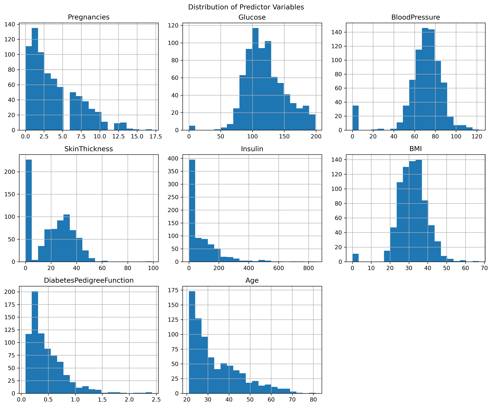
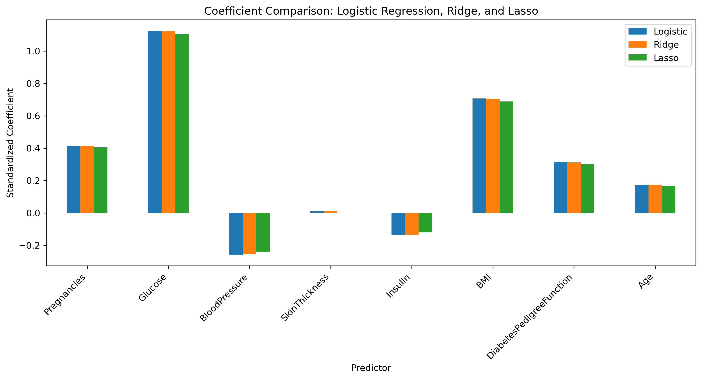
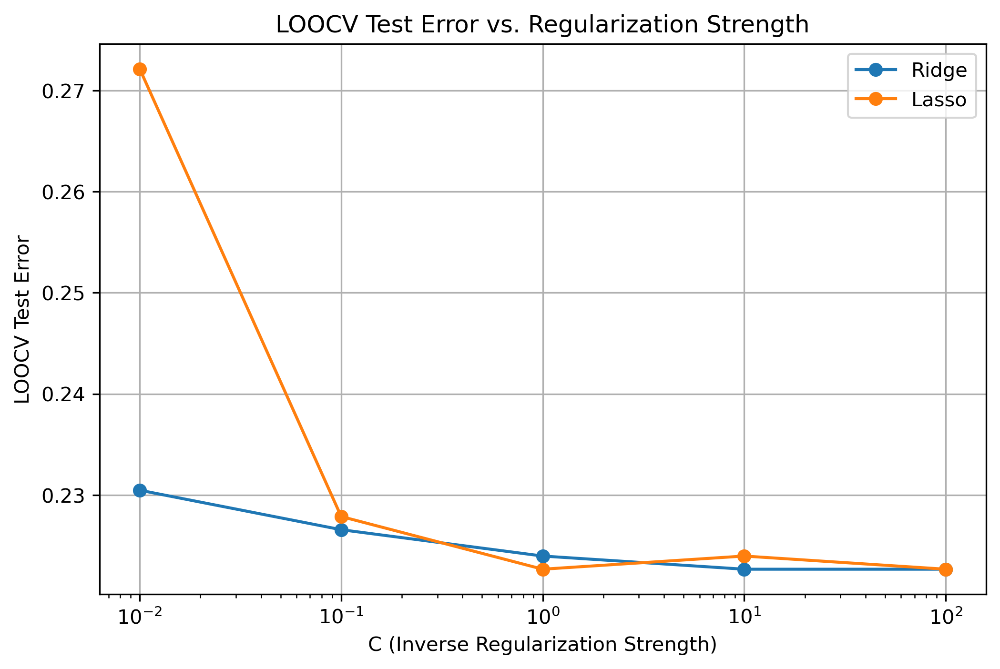

# Regularized Logistic Regression for Diabetes Classification
Diabetes classification using Logistic Regression, Ridge (L2), and Lasso (L1) with LOOCV, regularization tuning, and feature selection in Python.


## Project Overview

This project compares **ordinary Logistic Regression**, **Ridge (L2)**, and **Lasso (L1)** regularized logistic regression for diabetes classification using the Pima Indians Diabetes dataset.

Leave-One-Out Cross-Validation (LOOCV) is used to estimate test error and select the regularization parameter. The project demonstrates coefficient shrinkage, regularization tuning, and feature selection using Python.

## Methods

- Exploratory Data Analysis (EDA)
- Feature standardization
- Logistic Regression
- Ridge (L2) Regularization
- Lasso (L1) Regularization
- Leave-One-Out Cross-Validation (LOOCV)
- Regularization parameter tuning
- Coefficient comparison
- Feature selection

## Results

| Model | Best C | LOOCV Test Error |
|---|---:|---:|
| Logistic Regression | None | 22.27% |
| Ridge (L2) | 10 | 22.27% |
| Lasso (L1) | 1 | 22.27% |

All three models achieved the same LOOCV test error of **22.27%**. Ridge retained all predictors while shrinking their coefficients toward zero. Lasso reduced the coefficient of **SkinThickness to zero**, demonstrating its ability to perform feature selection.

## Figures

### Predictor Distributions



### Coefficient Comparison



### LOOCV Test Error vs. Regularization Strength



## Key Findings

- Logistic Regression, Ridge, and Lasso achieved similar predictive performance.
- Ridge shrinks coefficients toward zero while retaining all predictors.
- Lasso can shrink coefficients exactly to zero and perform feature selection.
- Glucose had the largest positive coefficient across the models.
- LOOCV was used to evaluate model performance and select the regularization strength.

## Tools & Libraries

- Python
- Pandas
- NumPy
- Matplotlib
- Seaborn
- Scikit-learn

## Repository Structure

```text
Regularized-Logistic-Regression-Diabetes/
│
├── Data/
│   └── diabetes.csv
│
├── Figures/
│   ├── predictor_distributions.png
│   ├── coefficient_comparison.png
│   └── loocv_regularization.png
│
├── Regularization in Logistic Regression.ipynb
└── README.md
